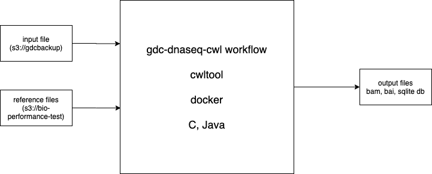

# GDC Workflow Runner

## Overview 

- GDC workflows are written in Common Workflow Language (CWL), and can be found in the [NCI-GDC github organisation](https://github.com/NCI-GDC/)

- GDC workflows are used for production with the GDC Pipeline Automation System (GPAS). For the 4 workflows that needs to be tested, we created external user entrypoints that can be used independently without GPAS. Check README in each repo for more details.
  - [DNA alignment](https://github.com/NCI-GDC/gdc-dnaseq-cwl/tree/feat/BINF-309)
    - To convert user submitted DNA-Seq (WGS, WXS) BAM files into a GDC re-alignment BAM file.
    - Some other files such as BAI file, and alignment metrics are also generated.
  - [WGS variant calling](https://github.com/NCI-GDC/gdc-sanger-somatic-cwl)
    - To accept a pair of tumor and normal WGS BAM files, and derive somatic mutation in VCF/ TSV/ PEDPE, and other outputs.
  - [WXS variant calling](https://github.com/NCI-GDC/gdc-somatic-variant-calling-workflow)
    - To accept a pair of tumor and normal WXS BAM files, and derive somatic mutations in VCF, and other outputs.
  - [RNA alignment](https://github.com/NCI-GDC/gdc-rnaseq-cwl/tree/feat/etl)
    - To accept BAM or FASTQ inputs, and derive 3 different BAMs, quantification TSV, spliceJunction TSV, and other outputs. 

- GDC workflows load dockers. All external dockers are public, and internal dockers are hosted in quay.io. We have created a quay group to share the required dockers to the APS team for testing purposes. (Will require quay id of AWP team members to add into this group) 

- GDC workflows require input molecular files. Stored in the `uchig-genomics-pipeline-us-east-1` s3 bucket. 

- GDC workflows require other reference files (such as human genome sequence). Also stored in the `uchig-genomics-pipeline-us-east-1` bucket. 

_Figure 1: Overview of GDC workflow_ 


First workflow that we will run will be a DNA-Seq Alignment workflow on a 2.5Gb WGS bam file. 

## Prereqs

- **EC2** instance resources depend on the type of workflow running and the size of the input file. In this(We used c5d.4xlarge):
  - cpus > 4 
  - ram > 12 Gb
  - disk space > 50Gb 
- Access to gdc-dnaseq-cwl workflow in github
- Access to **uchig-genomics-pipeline-us-east-1** buckets. 
- Requirements on the instance: 
  - awscli
  - docker
  - Access to quay (for docker images)
  - python
  - cwltool
  - nodejs

We have checked in a chef cookbook (gpas-worker) that can be used to build an AMI that will have all the requirements baked in. You can find the instructions [here](packer/README.md).


## Running the workflow 

### Download requirements

Pull the required repositories. 

- The dna-seq alignment workflow

```
git clone -b feat/BINF-309 git@github.com:NCI-GDC/gdc-dnaseq-cwl.git
```

- Scripts to run the workflow 
```
git clone git@github.com:NCI-GDC/gpas-aws-workflow-runner.git
```

- Download all the reference files. By default all files are downloaded to `/mnt/SCRATCH/reference/hwf/`. You can pass a different value in the argument if you like. Ensure current user has write access to this directory. `sudo mkdir -p /mnt/SCRATCH && sudo chown -R ${USER}:${USER} /mnt/SCRATCH` 
```
cd gpas-aws-workflow-runner/workflows/
./download-input-files.sh
```

- Pack the cwlworkflow into a json. We use this internally to pass it as a payload. 
```
./pack-workflow.sh /path/to/gdc-dnaseq-cwl/workflows/main/gdc_dnaseq_main_workflow.cwl
```

- Download the input bam file file. 
```
aws s3 cp s3://uchig-genomics-pipeline-us-east-1/4a43affb-57a2-4fc6-a483-96716511ab5e/A77474_1_lane_dupsFlagged.bam .
```

- Edit `input.json` to update the location of the input and reference files. 
  - We saved the input file at `/mnt/SCRATCH/playground/benchmark/BINF-308/wgs/A77474_1_lane_dupsFlagged.bam` but it can be anywhere really. 
  - We saved the reference files under `/mnt/SCRATCH/reference/hwf/`

### Run workflow

- Run the script in a directory where you want to store the output file.  
```
$ df -h /mnt
/dev/nvme0n1    366G   57G  310G  16% /mnt

cd /mnt/SCRATCH
```

- Run the script 
```
/home/ubuntu/gpas-aws-workflow-runner/workflows/run-workflow.sh
```
